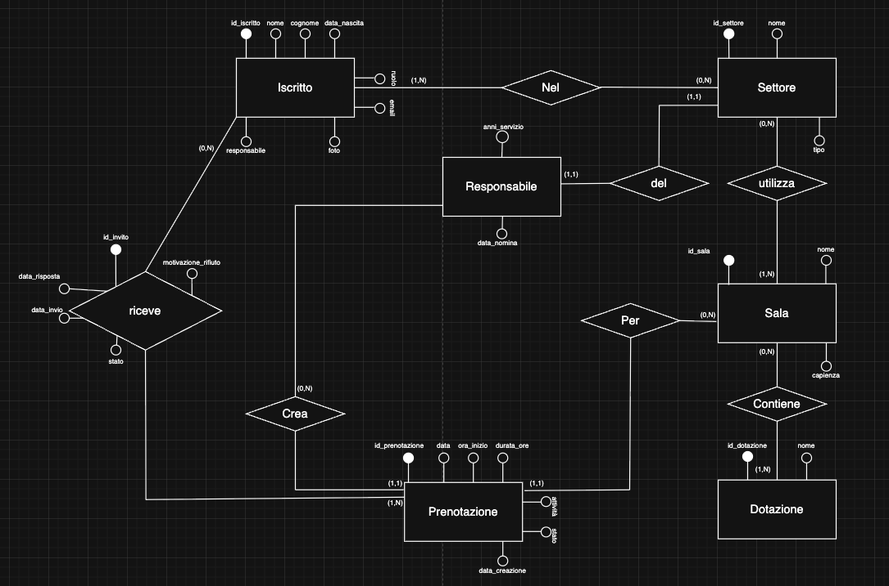
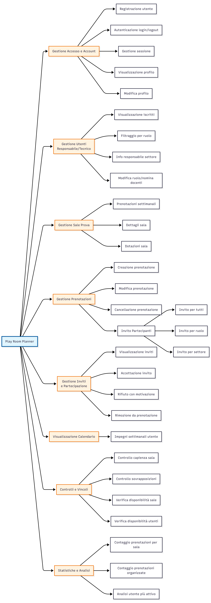

# Documentazione Tecnica - Play Room Planner

**Corso:** Programmazione per il Web A.A. 2025/2026  

**Titolo del Progetto:** Progettazione e realizzazione di un applicativo Web Play Room Planner

**Data di Consegna:** 21/01/2026  

**Componenti del Gruppo:**  
- Alessandro De Nicola (**referente**) 
     - Matricola: 21572A, 
 
     - Email: alessandro.denicola@studenti.unimi.it
- Giuseppe Benvenuto Rivezzi
    - Matricola: 21594A
    - Email: giuseppe.rivezzi@studenti.unimi.it
  
**Docente di Riferimento:** prof.Mesiti

**Il progetto *non* è stato consegnato in precedenza**

## 1. Progettazione Concettuale

In questa sezione vanno riportate le conclusioni della progettazione concettuale con schema ER finale, motivazioni e assunzioni.

### 1.1 Schema ER



Lo schema ER utilizza entità, associazioni, gerarchie di ISA, identificatori misti e attributi composti.

### 1.2 Assunzioni 

1. Si assume che il responsabile non sia un iscritto (che sia quindi un'entità a parte rispetto all'scritto) [ASSUNZIONE POI RIBALTATA]
2. Si assume che un responsabile possa occuparsi di più settori contemporaneamente. [ASSUNZIONE POI RIBALTATA]
3. Si assume che il ruolo dell’iscritto (docente, allievo, tecnico) sia un attributo dell’entità Iscritto e non una specializzazione, in quanto non sono richiesti comportamenti o attributi distinti aggiuntivi per ciascun ruolo.
4. Si assume che le dotazioni di supporto siano intese come tipologie di dotazioni (ad esempio: strumenti musicali, impianti audio, specchi, palcoscenico) e non come singoli oggetti fisici; pertanto la stessa tipologia di dotazione può essere associata a più sale.
5. Si assume che una prenotazione riguardi una sola sala; nel caso di attività che richiedano più sale, esse devono essere modellate tramite più prenotazioni distinte.
6. Si assume che solo gli iscritti che hanno ricevuto un invito possano partecipare a una prenotazione; la partecipazione senza invito non è ammessa.
7. Si assume che gli inviti agli iscritti siano modellati come associazione tra Iscritto e Prenotazione, con attributi che permettono di rappresentare l’esito della risposta (accettazione o rifiuto), la data della risposta e la motivazione dell'eventuale rifiuto.
8. Si assume che le modalità di selezione degli invitati (tutti gli iscritti, iscritti di un settore, iscritti con un certo ruolo) siano considerate meccanismi applicativi e non concetti strutturali del modello E-R.

### 1.3 Vincoli di Integrità

1. **Vincolo di sovrapposizione delle prenotazioni:** Non possono esistere due prenotazioni che occupino la stessa sala in intervalli di tempo sovrapposti.
2. **Vincolo sugli orari di prenotazione:** Le prenotazioni delle sale possono avvenire esclusivamente per ore intere e solo nella fascia oraria compresa tra le 9:00 e le 23:00.
4. **Vincolo di prenotazione sale:** Un responsabile può creare una prenotazione per una sala solo se il Tipo del settore di cui è responsabile coincide con il Tipo del settore a cui appartiene la sala prenotata.
5. **Vincolo di partecipazione su invito:** Un iscritto può partecipare a una prenotazione solo se ha ricevuto un invito relativo a quella prenotazione.
6. **Vincolo di capienza della sala:** Il numero di iscritti che confermano la partecipazione a una prenotazione non può superare la capienza massima della sala associata alla prenotazione.
7. **Vincolo di risposta all’invito:** Per ogni invito associato a una prenotazione, l’iscritto può confermare la propria presenza o declinare l’invito specificando una motivazione. In entrambi i casi deve essere registrata la data della risposta.
8. **Vincolo di notifica all’organizzatore:** Ogni risposta a un invito deve generare una notifica al responsabile che ha creato la prenotazione.
9. **Vincolo di unicità della risposta:** Ogni iscritto può fornire una sola risposta per ciascun invito relativo a una prenotazione.

### 1.4 Schema ER Ristrutturato


#### 1.4.1 Nuovi Vincoli
1. **Vincolo di autorizzazione alla creazione delle prenotazioni:** Solo gli iscritti che ricoprono il ruolo di responsabile di settore (o i tecnici) possono creare prenotazioni.
#### 1.4.2 Nuove Assunzioni (cambiamento principale)
1. Si assume che ogni responsabile di settore sia necessariamente un iscritto dell’associazione; pertanto non è stata tolta l’entità autonoma Responsabile, ma il ruolo di responsabile è modellato come relazione tra Iscritto e Settore con attributi propri.

### 1.5 Dominio degli attributi
#### 1. Entità: Iscritto (Utente)

Rappresenta tutti gli utenti del sistema. Il dominio del ruolo è vincolato per garantire la coerenza della logica RBAC (Role-Based Access Control).

id_iscritto: int (Auto-increment, Primary Key)

nome: string

cognome: string

email: string (Formato RFC 5322)

password: string (Hash memorizzato come varchar(255))

data_nascita: date

ruolo: dom_ruoli

dom_ruoli: {allievo, docente, tecnico}

foto: string (Percorso URL o file path)

#### 2. Entità: Settore

Identifica le macro-aree della Play Room.

id_settore: int

nome_settore: string (es: "Studio A", "Sala Prove 1")

descrizione: text

#### 3. Entità: Sala

id_sala: int

nome_sala: string

capienza: int (Valore > 0)

#### 4. Entità: Dotazione

id_dotazione: int

nome_strumento: string

stato_conservazione: dom_stato

dom_stato: {nuovo, usato, danneggiato, in_riparazione}

#### 5. Entità: Prenotazione

Rappresenta l'occupazione di una sala in un determinato momento.

id_prenotazione: int

giorno_settimana: dom_giorno

dom_giorno: {Lunedì, Martedì, Mercoledì, Giovedì, Venerdì, Sabato, Domenica}

ora_inizio: time

ora_fine: time (Vincolo: ora_fine > ora_inizio)

#### 6. Associazione: Responsabile di (Associazione tra Iscritto e Settore)

Relazione 1:1 tra Settore e Docente (Responsabile).

data_nomina: date

note: string

#### 7. Associazione: Invito (Associazione tra Impegno e Allievo)

Gestisce la partecipazione degli allievi alle sessioni create dai docenti.

stato_accettazione: dom_accettazione

dom_accettazione: {pendenza, accettato, rifiutato}


## 2. Progettazione Logica e Comandi SQL

Derivazione schema relazionale dallo schema ER ristrutturato.

### 2.1 Schema Relazionale

Iscritto (<u>id_iscritto</u>, nome, cognome, data_nascita, ruolo, email, password, foto)

Settore (<u>id_settore</u>, nome, tipo, id_responsabile<sup>Iscritto</sup>, anni_servizio, data_nomina)

Sala (<u>id_sala</u>, nome, capienza, id_settore<sup>Settore</sup>)

Dotazione (<u>id_dotazione</u>, nome)

Prenotazione (<u>id_prenotazione</u>, data, ora_inizio, durata_ore, attivita, stato, data_creazione, id_sala<sup>Sala</sup>, id_organizzatore<sup>Iscritto</sup>)

afferisce (<u>id_iscritto<sup>Iscritto</sup>, id_settore<sup>Settore</sup></u>)

contiene (<u>id_sala<sup>Sala</sup>, id_dotazione<sup>Dotazione</sup></u>)

invito (<u>id_iscritto<sup>Iscritto</sup>, id_prenotazione<sup>Prenotazione</sup></u>, data_invio, data_risposta, stato, motivazione_rifiuto)


#### Note Progettuali:
- **Accorpamento Relazione 1:1**: La relazione "Responsabile di" è stata accorpata nella tabella `Settore`.
- **Traduzione Relazioni 1:N**: Le relazioni "Per", "Crea" e "Utilizza" sono state implementate tramite chiavi esterne.
- **Traduzione Relazioni N:M**: Le relazioni "Nel", "Contiene" e "riceve" sono state trasformate in tabelle di associazione.
- **Integrità dell'Invito**: La tabella `invito` utilizza una chiave primaria composta (`id_prenotazione`, `id_iscritto`).

```sql
CREATE TABLE invito (
    id_iscritto INT,
    id_prenotazione INT,
    data_invio DATE,
    data_risposta DATETIME,
    stato ENUM('accettato', 'rifiutato', 'pendente') DEFAULT 'pendente',
    motivazione_rifiuto TEXT,
    PRIMARY KEY (id_iscritto, id_prenotazione),
    FOREIGN KEY (id_iscritto) REFERENCES Iscritto(id_iscritto),
    FOREIGN KEY (id_prenotazione) REFERENCES Prenotazione(id_prenotazione)
);
```
-- Altre tabelle (Settori, Sale, Prenotazioni, Iscritto, ecc.) seguono la logica ER

### 2.2 Query SQL

#### 1. Verifica capienza sala per ogni prenotazione
Calcola quanti iscritti hanno accettato l'invito e confronta il numero con la capienza massima della sala.
```sql
SELECT 
    p.id_prenotazione,
    s.nome AS sala,
    s.capienza,
    COUNT(i.id_iscritto) AS partecipanti_confermati
FROM Prenotazione p
JOIN Sala s ON p.id_sala = s.id_sala
LEFT JOIN invito i 
    ON p.id_prenotazione = i.id_prenotazione
    AND i.stato = 'accettato'
GROUP BY p.id_prenotazione, s.nome, s.capienza;

```

#### 2. Conteggio prenotazioni per giorno e per sala
Include sia le prenotazioni organizzate che quelle a cui si è stati invitati (con risposta positiva).
```sql
SELECT 
    p.data,
    s.nome AS sala,
    COUNT(*) AS numero_prenotazioni
FROM Prenotazione p
JOIN Sala s ON p.id_sala = s.id_sala
WHERE p.stato = 'confermata'
GROUP BY p.data, s.nome;

```

#### 3. Verifica sovrapposizione sala
Query per individuare se una sala è già occupata in un determinato giorno e fascia oraria (es. Sala 1, 01/02/2025, ore 10-12).
```sql
SELECT COUNT(*) AS conflitti
FROM Prenotazione
WHERE id_sala = ?
  AND data = ?
  AND stato = 'confermata'
  AND (
        ora_inizio < (? + ?)
    AND (ora_inizio + durata_ore) > ?
  );

```

#### 4. Verifica sovrapposizione impegni utente
Controlla se un utente (ID 2) ha già accettato un altro impegno che si sovrappone alla nuova prenotazione.
```sql
SELECT p.id_prenotazione
FROM Prenotazione p
JOIN invito i ON p.id_prenotazione = i.id_prenotazione
WHERE i.id_iscritto = ?
  AND i.stato = 'accettato'
  AND p.data = ?
  AND (
        p.ora_inizio < (? + ?)
    AND (p.ora_inizio + p.durata_ore) > ?
  );

```

#### 5.	Prenotazioni con partecipanti esterni al settore dell'organizzatore 
Trova le prenotazioni dove il numero di partecipanti confermati è superiore al numero totale di membri del settore di appartenenza del responsabile che ha creato la prenotazione.
```sql
SELECT p.id_prenotazione, p.attivita
FROM Prenotazione p
JOIN Settore s ON p.id_organizzatore = s.id_responsabile
WHERE
(
    SELECT COUNT(*)
    FROM invito i
    WHERE i.id_prenotazione = p.id_prenotazione
      AND i.stato = 'accettato'
) > (
    SELECT COUNT(*)
    FROM afferisce a
    WHERE a.id_settore = s.id_settore
);

```
## 3. Progettazione dell’applicativo Web
L’applicativo Play Room Planner è stato progettato seguendo un’architettura Client–Server, ispirata al pattern MVC (Model–View–Controller).

### 3.1 Architettura MVC
#### Model (Dati)
Il livello dei dati è gestito da un database relazionale MySQL, ospitato su server XAMPP. La struttura dei dati rispetta lo schema E–R progettato, con entità centrali quali Iscritto, Sala e Prenotazione.

#### View (Interfaccia)
L’interfaccia utente è realizzata utilizzando HTML5 e CSS3, con il supporto del framework Bootstrap 5, al fine di garantire una fruizione responsive, adattabile sia a dispositivi desktop sia a tablet/mobile.

#### Controller (Logica applicativa)
La logica applicativa è suddivisa tra:

#### 1. Backend: 
API sviluppate in PHP, responsabili dell’accesso ai dati, dell’applicazione dei vincoli e della gestione della sicurezza;
#### 2. Frontend: 
logica implementata tramite HTML, JavaScript e chiamate AJAX, incaricata di gestire le interazioni dell’utente e le transizioni di stato dell’interfaccia.

L’interazione con l’applicativo segue un paradigma di **Single Page Interaction**: l’utente non è soggetto a continui ricaricamenti della pagina.Le info dinamiche vengono caricate in modo asincrono tramite chiamate alle API.

### 3.2 Albero delle funzionalità



Rappresentazione grafica della gerarchia di navigazione dell'applicativo.

### 3.3 foglio di stile
File: css/app.css

Partendo dalle funzionalità e dallo stile forniti da Bootstrap, è stato selezionato un template di tipo Admin (AdminKit), successivamente personalizzato per rispettare le richieste dell'applicativo:
```css
/*codice css - AdminKit*/

.profile-img-lg {
    width: 120px;
    height: 120px;
    object-fit: cover;
    background-color: #eee;
    border: 1px solid #dee2e6;
}


.cursor-pointer {
    cursor: pointer;
}
.cursor-pointer:hover {
    text-decoration: underline;
}


.opacity-50 {
    opacity: 0.5 !important;
    pointer-events: none;
}

.hover-shadow:hover {
    transform: translateY(-5px);
    box-shadow: 0 1rem 3rem rgba(0,0,0,.175)!important;
    cursor: pointer;
}


.transition {
    transition: all 0.3s ease-in-out;
}


.shadow-inset {
    box-shadow: inset 0 2px 4px rgba(0,0,0,0.06);
}


.bg-light-subtle {
    background-color: #f8f9fa !important;
}


/* Barra di progresso */
.progress {
    display: flex;
    height: 1.5rem;
    overflow: hidden; 
    font-size: .75rem;
    background-color: #e9ecef; 
    border-radius: 1rem; 
    box-shadow: inset 0 2px 4px rgba(0,0,0,0.1);
    margin-bottom: 1rem;
}


.progress-bar {
    display: flex;
    flex-direction: column;
    justify-content: center;
    overflow: hidden;
    color: #fff;
    text-align: center;
    white-space: nowrap;
    transition: width 0.6s ease;
    
    
    background-image: linear-gradient(
        45deg, 
        rgba(255,255,255,.15) 25%, 
        transparent 25%, 
        transparent 50%, 
        rgba(255,255,255,.15) 50%, 
        rgba(255,255,255,.15) 75%, 
        transparent 75%, 
        transparent
    );
    background-size: 1rem 1rem;
}


.progress-bar-animated {
    animation: progress-bar-stripes 1s linear infinite;
}

@keyframes progress-bar-stripes {
    0% { background-position-x: 1rem; }
    100% { background-position-x: 0; }
}


.progress-bar.bg-success {
    background-color: #198754 !important; 
    box-shadow: 0 0 10px rgba(25, 135, 84, 0.4); 
}


.progress-bar.bg-warning {
    background-color: #ffc107 !important; 
    color: #000 !important; 
    box-shadow: 0 0 10px rgba(255, 193, 7, 0.4);
}


.progress-bar.bg-danger {
    background-color: #dc3545 !important;
    box-shadow: 0 0 10px rgba(220, 53, 69, 0.4);
}

.progress-bar {
    background-color: #3b7ddd; 
}


.password-requirements {
    font-size: 0.85rem;
    background-color: #f8f9fa;
    border: 1px solid #dee2e6;
    border-radius: 0.375rem;
    padding: 10px;
    margin-top: 5px;
    transition: all 0.3s ease;
}

.req-item {
    display: flex;
    align-items: center;
    color: #6c757d; 
    margin-bottom: 2px;
    transition: color 0.2s;
}

.req-item i {
    margin-right: 8px;
    font-size: 1rem;
}


.req-item.valid {
    color: #198754;
    font-weight: 600;
}


.invalid-feedback {
    font-size: 0.875em;
    background-color: #f8d7da; 
    color: #842029; 
    border: 1px solid #f5c2c7;
    padding: 8px;
    border-radius: 4px;
    margin-top: 5px;
}
```

### 3.4 API e script PHP
#### 3.4.1 Gestione utenti (inserimento, cancellazione e modifica)
File: backend/users.php

API per la gestione dei dati degli utenti (Iscritto): consente la visualizzazione dei profili, la modifica delle informazioni personali e l’aggiornamento delle credenziali, nel rispetto dei permessi dell’utente autenticato.
```php
<?php
declare(strict_types=1);

require_once __DIR__ . '/../common/config.php';
require_once __DIR__ . '/../common/api_auth.php';

header('Content-Type: application/json; charset=utf-8');

function ok($data=null, int $code=200): void { http_response_code($code); echo json_encode(['ok'=>true,'data'=>$data]); exit; }
function err(string $m, int $code=400): void { http_response_code($code); echo json_encode(['ok'=>false,'message'=>$m]); exit; }

$method = $_SERVER['REQUEST_METHOD'];
$id = isset($_GET['id']) ? (int)$_GET['id'] : 0;
$uid = (int)($_SESSION['user_id'] ?? 0);

try {
  
  if ($method === 'GET') {
    if ($id > 0) {
      
      $sql = "SELECT 
                i.id_iscritto, i.nome, i.cognome, i.ruolo, i.email, i.foto, i.data_nascita,
                s.nome AS nome_settore_resp, s.anni_servizio, s.data_nomina
            FROM Iscritto i
            LEFT JOIN Settore s ON i.id_iscritto = s.id_responsabile
            WHERE i.id_iscritto = ?";
      
      $st = $pdo->prepare($sql);
      $st->execute([$id]);
      $u = $st->fetch(PDO::FETCH_ASSOC);
      
      if (!$u) err('Utente non trovato', 404);

      $st2 = $pdo->prepare("SELECT id_settore FROM afferisce WHERE id_iscritto=?");
      $st2->execute([$id]);
      $u['settori_ids'] = $st2->fetchAll(PDO::FETCH_COLUMN);

      ok($u);
    } else {
      
      $st = $pdo->query("SELECT id_iscritto, nome, cognome, ruolo, email, foto FROM Iscritto");
      ok($st->fetchAll(PDO::FETCH_ASSOC));
    }
  }

  
  if ($method === 'POST' && isset($_FILES['foto'])) {
      if ($id !== $uid) err('Puoi modificare solo la tua foto', 403);
      
      $file = $_FILES['foto'];
      $ext = strtolower(pathinfo($file['name'], PATHINFO_EXTENSION));
      $allowed = ['jpg', 'jpeg', 'png', 'gif'];
      
      if (!in_array($ext, $allowed)) err('Formato non valido. Usa JPG o PNG.');
      if ($file['size'] > 2 * 1024 * 1024) err('File troppo grande (max 2MB).');

      
      $newDetails = $id . '_' . time() . '.' . $ext;
      $destPath = __DIR__ . '/../Images/' . $newDetails;

      if (!move_uploaded_file($file['tmp_name'], $destPath)) {
          err('Errore nel salvataggio del file.');
      }

      
      $st = $pdo->prepare("UPDATE Iscritto SET foto = ? WHERE id_iscritto = ?");
      $st->execute([$newDetails, $id]);

      ok(['file' => $newDetails, 'message' => 'Foto aggiornata']);
  }

 
  if ($method === 'POST' && !isset($_FILES['foto'])) {
   
    $data = json_decode(file_get_contents('php://input'), true);
  }

 
 if ($method === 'PUT') {
    if ($id <= 0) err('id mancante', 422);
    if ($id !== $uid) err('Puoi modificare solo il tuo profilo', 403);

    $data = json_decode(file_get_contents('php://input'), true);

    
    if (isset($data['old_password']) && isset($data['new_password'])) {
        
        $oldPass = $data['old_password'];
        $newPass = $data['new_password'];

        
        $q = $pdo->prepare("SELECT password FROM Iscritto WHERE id_iscritto = ?");
        $q->execute([$id]);
        $currentHash = $q->fetchColumn();

        
        if (!$currentHash || !password_verify($oldPass, $currentHash)) {
           
            err('La password attuale inserita non è corretta.', 401);
        }

        
        $hasUpper = preg_match('@[A-Z]@', $newPass);
        $hasSpecial = preg_match('@[^\w]@', $newPass);

        if (strlen($newPass) < 8 || !$hasUpper || !$hasSpecial) {
            err('La nuova password non rispetta i requisiti di sicurezza.', 400);
        }

        
        $newHash = password_hash($newPass, PASSWORD_BCRYPT);
        $upd = $pdo->prepare("UPDATE Iscritto SET password = ? WHERE id_iscritto = ?");
        $upd->execute([$newHash, $id]);

        ok(['message' => 'Password aggiornata con successo']);
    }
    

    $nome = trim((string)($data['nome'] ?? ''));
    $cognome = trim((string)($data['cognome'] ?? ''));
    
    
    $fields = []; $params = [];
    if ($nome !== '') { $fields[] = "nome=?"; $params[] = $nome; }
    if ($cognome !== '') { $fields[] = "cognome=?"; $params[] = $cognome; }
    
    if (!$fields) err('Nessun campo valido inviato', 422);

    $params[] = $id;
    $sql = "UPDATE Iscritto SET " . implode(', ', $fields) . " WHERE id_iscritto=?";
    $st = $pdo->prepare($sql);
    $st->execute($params);

    ok(['message' => 'Profilo aggiornato']);
  }

} catch (Exception $e) {
  err('Errore server: '.$e->getMessage(), 500);
}

```
*N.B.*: Gli iscritti con ruolo "tecnico" hanno la possibilità di modificare il ruolo e assegnare docenti in quanto responsabili di settori. NON possono modificare dati anagrafici(cosa permessa agli utenti stessi nella sezione Profilo). E' resa possibile anche la cancellazione di un'utenza (sempre al tecnico) 

#### 3.4.2 Gestione prenotazioni (inserimento, cancellazione e modifica)
File: backend/bookings.php

API che gestisce l’intero sistema delle prenotazioni (inserimento, modifica, annullamento), applicando i vincoli relativi a orari, sovrapposizioni temporali, autorizzazioni per ruolo e la concessione per settore e sala.
```php
<?php
declare(strict_types=1);

require_once __DIR__ . '/../common/config.php';
require_once __DIR__ . '/../common/api_auth.php';

header('Access-Control-Allow-Methods: GET, POST, PUT, DELETE, OPTIONS');
header('Access-Control-Allow-Headers: Content-Type');
if ($_SERVER['REQUEST_METHOD'] === 'OPTIONS') { http_response_code(204); exit; }

function ok($data=null, int $code=200): void { http_response_code($code); echo json_encode(['ok'=>true,'data'=>$data]); exit; }
function err(string $m, int $code=400): void { http_response_code($code); echo json_encode(['ok'=>false,'message'=>$m]); exit; }

$method = $_SERVER['REQUEST_METHOD'];
$id = isset($_GET['id']) ? (int)$_GET['id'] : 0;

$uid = (int)($_SESSION['user_id'] ?? 0);
if ($uid <= 0) err('Non autenticato', 401);

function is_tecnico(): bool {
  return ((string)($_SESSION['user_ruolo'] ?? '')) === 'tecnico';
}

/**
 * Permessi:
 * - Tecnico: può prenotare qualunque sala
 * - Responsabile: deve essere responsabile di un settore
 */
function require_can_manage_bookings(PDO $pdo, int $uid): void {
  if (is_tecnico()) return;

  $st = $pdo->prepare("SELECT 1 FROM Settore WHERE id_responsabile=? LIMIT 1");
  $st->execute([$uid]);
  if (!$st->fetchColumn()) {
    err('Operazione consentita solo ai responsabili di settore o ai tecnici', 403);
  }
}

function validate_slot(int $ora, int $dur): void {
  if ($ora < 9 || $ora > 23) err('ora_inizio deve essere tra 9 e 23', 422);
  if ($dur <= 0) err('durata_ore non valida', 422);
  if ($ora + $dur > 23) err('La prenotazione deve terminare entro le 23', 422);
}

function validate_not_in_past(string $date, int $ora): void {
  $d = DateTimeImmutable::createFromFormat('Y-m-d', $date);
  if (!$d) err('Data non valida (formato atteso YYYY-MM-DD)', 422);

  $today = new DateTimeImmutable('today');
  if ($d < $today) {
    err('Non puoi prenotare nel passato', 422);
  }

  if ($d->format('Y-m-d') === $today->format('Y-m-d')) {
    $now = new DateTimeImmutable('now');
    $nextHour = ((int)$now->format('G')) + 1; // prossima ora intera
    $minHour = max(9, min(23, $nextHour));
    if ($ora < $minHour) {
      err('Per oggi puoi prenotare solo a partire dalla prossima ora', 422);
    }
  }
}

function can_book_room(PDO $pdo, int $uid, int $idSala): bool {
  if (is_tecnico()) return true;

  $sql = "
    SELECT 1
    FROM Sala s
    JOIN Settore seSala ON seSala.id_settore = s.id_settore
    WHERE s.id_sala = :idSala
      AND (
        seSala.id_responsabile = :uid1
        OR seSala.tipo IN (
          SELECT seMio.tipo
          FROM Settore seMio
          WHERE seMio.id_responsabile = :uid2
        )
      )
    LIMIT 1
  ";
  $st = $pdo->prepare($sql);
  $st->execute(['idSala' => $idSala, 'uid1' => $uid, 'uid2' => $uid]);
  return (bool)$st->fetchColumn();
}

function check_room_overlap(PDO $pdo, int $idSala, string $data, int $ora, int $dur, ?int $excludeId = null): void {
  $hasExclude = ($excludeId !== null);

  $sql = "
    SELECT 1
    FROM Prenotazione p2
    WHERE p2.id_sala = :idSala
      AND p2.data = :data
      AND p2.stato = 'confermata'
      " . ($hasExclude ? "AND p2.id_prenotazione <> :excludeId" : "") . "
      AND NOT (
        (p2.ora_inizio + p2.durata_ore) <= :start1
        OR (:start2 + :dur1) <= p2.ora_inizio
      )
    LIMIT 1
  ";

  $params = [
    'idSala' => $idSala,
    'data'   => $data,
    'start1' => $ora,
    'start2' => $ora,
    'dur1'   => $dur
  ];
  if ($hasExclude) $params['excludeId'] = $excludeId;

  $st = $pdo->prepare($sql);
  $st->execute($params);

  if ($st->fetch()) err('Sala già occupata in quell’intervallo', 409);
}

try {
  if ($method === 'GET') {
    if ($id > 0) {
      $st = $pdo->prepare("
        SELECT p.*, s.nome AS nome_sala
        FROM Prenotazione p
        JOIN Sala s ON s.id_sala = p.id_sala
        WHERE p.id_prenotazione = ?
      ");
      $st->execute([$id]);
      $row = $st->fetch();
      if (!$row) err('Prenotazione non trovata', 404);
      ok($row);
    } else {
      $st = $pdo->prepare("
        SELECT p.*, s.nome AS nome_sala
        FROM Prenotazione p
        JOIN Sala s ON s.id_sala = p.id_sala
        WHERE p.id_organizzatore = ?
        ORDER BY p.data ASC, p.ora_inizio ASC
      ");
      $st->execute([$uid]);
      ok($st->fetchAll());
    }
  }

  if ($method === 'POST') {
    require_can_manage_bookings($pdo, $uid);

    $data = json_decode(file_get_contents('php://input'), true);
    if (!is_array($data)) err('JSON non valido', 422);

    $idSala = (int)($data['id_sala'] ?? 0);
    $date = trim((string)($data['data'] ?? ''));
    $ora = (int)($data['ora_inizio'] ?? 0);
    $dur = (int)($data['durata_ore'] ?? 0);
    $attivita = trim((string)($data['attivita'] ?? ''));

    if ($idSala <= 0 || $date === '') err('Parametri mancanti', 422);

    if (!can_book_room($pdo, $uid, $idSala)) {
      err('Non puoi prenotare questa sala (settore non autorizzato)', 403);
    }

    validate_slot($ora, $dur);
    validate_not_in_past($date, $ora);
    check_room_overlap($pdo, $idSala, $date, $ora, $dur, null);

    $st = $pdo->prepare("
      INSERT INTO Prenotazione (data, ora_inizio, durata_ore, attivita, stato, id_sala, id_organizzatore)
      VALUES (?, ?, ?, ?, 'confermata', ?, ?)
    ");
    $st->execute([$date, $ora, $dur, $attivita, $idSala, $uid]);

    ok(['id_prenotazione' => (int)$pdo->lastInsertId()], 201);
  }

  if ($method === 'PUT') {
    require_can_manage_bookings($pdo, $uid);
    if ($id <= 0) err('id mancante', 422);

    $data = json_decode(file_get_contents('php://input'), true);
    if (!is_array($data)) err('JSON non valido', 422);

    $st = $pdo->prepare("SELECT * FROM Prenotazione WHERE id_prenotazione=?");
    $st->execute([$id]);
    $p = $st->fetch();
    if (!$p) err('Prenotazione non trovata', 404);

    // permesso: solo organizzatore (anche tecnico)
    if ((int)$p['id_organizzatore'] !== $uid) err('Non autorizzato', 403);

    $idSala = (int)($data['id_sala'] ?? $p['id_sala']);
    $date = trim((string)($data['data'] ?? $p['data']));
    $ora = (int)($data['ora_inizio'] ?? $p['ora_inizio']);
    $dur = (int)($data['durata_ore'] ?? $p['durata_ore']);
    $attivita = trim((string)($data['attivita'] ?? $p['attivita']));
    $stato = (string)($data['stato'] ?? $p['stato']);

    if (!can_book_room($pdo, $uid, $idSala)) {
      err('Non puoi prenotare questa sala (settore non autorizzato)', 403);
    }

    validate_slot($ora, $dur);
    validate_not_in_past($date, $ora);
    check_room_overlap($pdo, $idSala, $date, $ora, $dur, $id);

    $st = $pdo->prepare("
      UPDATE Prenotazione
      SET data=?, ora_inizio=?, durata_ore=?, attivita=?, stato=?, id_sala=?
      WHERE id_prenotazione=?
    ");
    $st->execute([$date, $ora, $dur, $attivita, $stato, $idSala, $id]);

    ok(['message' => 'Aggiornata']);
  }

  if ($method === 'DELETE') {
    require_can_manage_bookings($pdo, $uid);
    if ($id <= 0) err('id mancante', 422);

    $st = $pdo->prepare("SELECT id_organizzatore FROM Prenotazione WHERE id_prenotazione=?");
    $st->execute([$id]);
    $p = $st->fetch();
    if (!$p) err('Prenotazione non trovata', 404);

    if ((int)$p['id_organizzatore'] !== $uid) err('Non autorizzato', 403);

    $st = $pdo->prepare("UPDATE Prenotazione SET stato='annullata' WHERE id_prenotazione=?");
    $st->execute([$id]);

    ok(['message' => 'Annullata']);
  }

  err('Metodo non supportato', 405);

} catch (Throwable $e) {
  err('Errore server: ' . $e->getMessage() . ' (linea ' . $e->getLine() . ')', 500);
}


```

#### 3.4.3 Visualizzazione prenotazioni per sala per una data settimana
File: backend/room_bookings.php

API di sola lettura che restituisce l’elenco delle prenotazioni confermate di una specifica sala, organizzate per una settimana (da lunedì a domenica), ordinate cronologicamente.

```php
<?php
declare(strict_types=1);

require_once __DIR__ . '/../common/config.php';
require_once __DIR__ . '/../common/api_auth.php';

header('Content-Type: application/json; charset=utf-8');

function ok($data=null, int $code=200): void { http_response_code($code); echo json_encode(['ok'=>true,'data'=>$data]); exit; }
function err(string $m, int $code=400): void { http_response_code($code); echo json_encode(['ok'=>false,'message'=>$m]); exit; }

$roomId = isset($_GET['roomId']) ? (int)$_GET['roomId'] : 0;
$day = $_GET['day'] ?? date('Y-m-d');
$ts = strtotime($day);
if ($roomId <= 0) err('roomId mancante', 422);
if ($ts === false) err('day non valido', 422);


$dow = (int)date('N', $ts);
$monday = date('Y-m-d', strtotime('-'.($dow-1).' day', $ts));
$sunday = date('Y-m-d', strtotime('+'.(7-$dow).' day', $ts));

$stmt = $pdo->prepare("
  SELECT
    p.id_prenotazione, p.data, p.ora_inizio, p.durata_ore, p.attivita, p.stato,
    CONCAT(org.nome,' ',org.cognome) AS organizzatore
  FROM Prenotazione p
  JOIN Iscritto org ON org.id_iscritto = p.id_organizzatore
  WHERE p.id_sala = :rid
    AND p.data BETWEEN :monday AND :sunday
    AND p.stato = 'confermata'
  ORDER BY p.data ASC, p.ora_inizio ASC
");
$stmt->execute(['rid'=>$roomId, 'monday'=>$monday, 'sunday'=>$sunday]);

ok(['monday'=>$monday, 'sunday'=>$sunday, 'rows'=>$stmt->fetchAll()]);

```

#### 3.4.4 Visualizzazione degli impegni di un utente per una data settimana
File: backend/user_week.php

API che restituisce tutti gli impegni settimanali dell’utente autenticato, includendo sia le prenotazioni da lui organizzate sia quelle a cui partecipa su invito accettato.
```php
<?php
declare(strict_types=1);

ob_start();
ini_set('display_errors', '0');

require_once __DIR__ . '/../common/config.php';
require_once __DIR__ . '/../common/api_auth.php';

header('Content-Type: application/json; charset=utf-8');

$userId = (int)($_SESSION['user_id'] ?? 0);
if ($userId <= 0) {
  http_response_code(401);
  ob_clean();
  echo json_encode(['ok' => false, 'message' => 'Non autenticato'], JSON_UNESCAPED_UNICODE);
  exit;
}

$day = $_GET['day'] ?? date('Y-m-d');
$ts = strtotime($day);
if ($ts === false) {
  http_response_code(400);
  ob_clean();
  echo json_encode(['ok' => false, 'message' => 'Parametro day non valido'], JSON_UNESCAPED_UNICODE);
  exit;
}


$dow = (int)date('N', $ts);
$mondayTs = strtotime('-' . ($dow - 1) . ' day', $ts);
$sundayTs = strtotime('+' . (7 - $dow) . ' day', $ts);
$monday = date('Y-m-d', $mondayTs);
$sunday = date('Y-m-d', $sundayTs);

$sql = "
SELECT
  x.id_prenotazione,
  x.id_organizzatore,
  x.data,
  x.ora_inizio,
  x.durata_ore,
  x.attivita,
  x.nome_sala,
  x.organizzatore,
  x.stato_invito
FROM (
  SELECT
    p.id_prenotazione,
    p.id_organizzatore,
    p.data,
    p.ora_inizio,
    p.durata_ore,
    p.attivita,
    s.nome AS nome_sala,
    CONCAT(org.nome, ' ', org.cognome) AS organizzatore,
    i.stato AS stato_invito
  FROM invito i
  JOIN Prenotazione p ON p.id_prenotazione = i.id_prenotazione
  JOIN Sala s ON s.id_sala = p.id_sala
  JOIN Iscritto org ON org.id_iscritto = p.id_organizzatore
  WHERE i.id_iscritto = :uid
    AND p.data BETWEEN :monday AND :sunday
    AND p.stato = 'confermata'

  UNION

  SELECT
    p.id_prenotazione,
    p.id_organizzatore,
    p.data,
    p.ora_inizio,
    p.durata_ore,
    p.attivita,
    s.nome AS nome_sala,
    CONCAT(org.nome, ' ', org.cognome) AS organizzatore,
    COALESCE(i2.stato, 'organizzatore') AS stato_invito
  FROM Prenotazione p
  JOIN Sala s ON s.id_sala = p.id_sala
  JOIN Iscritto org ON org.id_iscritto = p.id_organizzatore
  LEFT JOIN invito i2
    ON i2.id_prenotazione = p.id_prenotazione
   AND i2.id_iscritto = :uid2
  WHERE p.id_organizzatore = :uid3
    AND p.data BETWEEN :monday2 AND :sunday2
    AND p.stato = 'confermata'
) AS x
ORDER BY x.data ASC, x.ora_inizio ASC
";

$stmt = $pdo->prepare($sql);
$stmt->execute([
  'uid' => $userId,
  'monday' => $monday,
  'sunday' => $sunday,
  'uid2' => $userId,
  'uid3' => $userId,
  'monday2' => $monday,
  'sunday2' => $sunday,
]);

$rows = $stmt->fetchAll();

$out = [];
$rejected = [];

foreach ($rows as $r) {
  $isOrganizer = ((int)$r['id_organizzatore'] === $userId);

  $row = [
    'id_prenotazione' => (int)$r['id_prenotazione'],
    'data' => $r['data'],
    'ora' => str_pad((string)((int)$r['ora_inizio']), 2, '0', STR_PAD_LEFT) . ':00',
    'durata' => ((int)$r['durata_ore']) . 'h',
    'sala' => $r['nome_sala'],
    'attivita' => $r['attivita'] ?? '',
    'organizzatore' => $r['organizzatore'],
    'stato_invito' => $r['stato_invito'],
    'can_cancel' => $isOrganizer,
  ];

  if ($r['stato_invito'] === 'rifiutato') $rejected[] = $row;
  else $out[] = $row;
}

ob_clean();
echo json_encode([
  'ok' => true,
  'data' => $out,
  'week' => ['monday' => $monday, 'sunday' => $sunday],
  'rejected' => $rejected
], JSON_UNESCAPED_UNICODE);
exit;


```

## 3.5 Tecnologie utilizzate
### PHP e PDO (Backend): 
Utilizzati nella cartella api/ e nel file common/config.php. 
**PHP** costituisce il motore lato server. Il driver **PDO**, in combinazione con prepared statements, garantisce la sicurezza contro attacchi di tipo SQL Injection.

**Sessioni PHP**: Inizializzate nello script api/user_login.php e verificate tramite il file common/auth_check.php per gestire l'accesso protetto.
**AJAX**: Implementato nei file JavaScript della cartella js/ per la comunicazione asincrona.

### JavaScript: 
Gestisce la manipolazione del DOM e la logica di interfaccia lato client.
**Cookies**: Gestiti automaticamente dal browser tramite il cookie PHPSESSID.

## 3.6 Scelte progettuali e implementative
In questa sezione vengono illustrate le scelte strategiche effettuate durante lo sviluppo.

### Modello di Autorizzazione basato sui Ruoli 
Sono stati definiti tre ruoli con permessi crescenti:

#### 1. Allievo: 
Accesso in sola lettura al proprio calendario impegni. Può gestire esclusivamente lo stato dei propri inviti.
#### 2. Docente: 
Può essere designato come Responsabile di Settore. Può creare prenotazioni e inviti per sale dello stesso settore.
#### 3. Tecnico (Admin): 
Detiene il controllo operativo. Unico autorizzato a modificare ruoli, nominare responabili dei settori e prenotare qualsiasi sala.

### Logica di Gestione delle Responsabilità di Settore
Il sistema applica una logica di sostituzione automatica: è ammesso un solo responsabile per ogni settore. Se il Tecnico assegna un nuovo Responsabile a un settore già occupato, il database aggiorna il record sostituendo automaticamente il precedente.

### Scalabilità
L'applicativo è stato sviluppato prevedendo l'aggiunta dinamica di nuovi iscritti: tramite una registrazione guidata si possono aggiungere utenti che avranno di defaul il ruolo di alunni. Sarà poi un tecnico a modificarne il ruolo (se necessario).

# 4. Applicativo Web sviluppato
L’applicativo Web  è incluso nello ZIP di consegna.
Il progetto è organizzato secondo la struttura richiesta, con file index.php e le sottocartelle Frontend, Backend, Common, JS, CSS e Images.
L’applicativo è stato testato in ambiente XAMPP su sistema Windows, anche in CLAB.
Si propone il file index.php per mostrare la struttura di partenza dell'intero applicativo.

```php
<?php
declare(strict_types=1);
require_once __DIR__ . '/common/config.php'; 
$page = $_GET['page'] ?? 'dashboard';


$publicPages = ['login', 'registrazione'];


if (!isset($_SESSION['user_id']) && !in_array($page, $publicPages, true)) {
    header('Location: index.php?page=login');
    exit;
}

$routes = [
    'login'         => __DIR__ . '/frontend/login_view.php',
    'registrazione' => __DIR__ . '/frontend/registrazione.php',
    'dashboard'     => __DIR__ . '/frontend/dashboard.php',
    'logout'        => __DIR__ . '/backend/logout.php',

    
    'profile'       => __DIR__ . '/frontend/profile.php',
    'invites'       => __DIR__ . '/frontend/invites.php',
    'my_week'       => __DIR__ . '/frontend/my_week.php',
    'rooms'         => __DIR__ . '/frontend/rooms.php',
    'booking_new'   => __DIR__ . '/frontend/booking_new.php',
    'reports'       => __DIR__ . '/frontend/reports_view.php',
    'users_manage'  => __DIR__ . '/frontend/users_manage.php',
    'users_edit'    => __DIR__ . '/frontend/users_edit.php',
    'booking_view'  => __DIR__ . '/frontend/booking_view.php',
    'booking_edit'  => __DIR__ . '/frontend/booking_edit.php',
    
];

if (!isset($routes[$page])) {
    http_response_code(404);
    echo "404 - Pagina non trovata";
    exit;
}

require $routes[$page];

```

